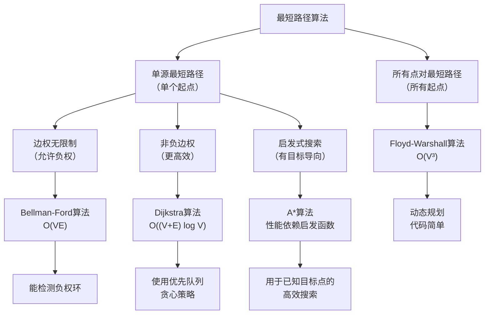

### 最短路径问题定义

给定一个带权图 `G = (V, E)`（V 是顶点集合，E 是边集合）和一个源点 `s`，我们希望找到从 `s` 到图中所有其他顶点（或某个特定目标顶点 `t`）的最短路径。

边的权重可以是正数、负数或零，但**不同算法对权重的限制不同**。

---

### 算法分类与介绍

根据图的特性和需求，我们可以选择不同的算法。下图清晰地展示了核心算法及其适用场景的分类：

#### 1. Dijkstra 算法

这是最著名、最常用的最短路径算法。

* **核心思想**：贪心算法。从源点开始，每次选择**当前已知最短距离最小**的顶点，然后松弛（更新）其所有邻居的距离。
* **前提条件**：图中**不能有负权边**。
* **数据结构**：通常使用优先队列（最小堆）来高效地获取当前距离最小的顶点。
* **时间复杂度**：

  * 使用数组：O(V²)
  * 使用二叉堆：O((V+E) log V)
  * 使用斐波那契堆：O(E + V log V)
* **算法步骤**：

  1. 初始化：将源点的距离设为0，其他所有点的距离设为无穷大。将所有顶点放入优先队列。
  2. 从优先队列中取出当前距离最小的顶点 `u`。
  3. 遍历 `u` 的所有邻居 `v`。如果通过 `u` 到 `v` 的距离比当前已知的 `v` 的距离更短，则更新 `v` 的距离。
  4. 重复步骤2和3，直到优先队列为空。
* **为什么不能有负权边？**
  因为Dijkstra算法基于贪心策略，一旦一个顶点被处理（从队列中取出），我们就认为已经找到了它的最短路径。如果存在负权边，可能会有一条通过未被处理顶点的路径，其总权值更小，从而破坏了贪心选择性质。

#### 2. Bellman-Ford 算法

这是一个更加通用的算法，可以处理负权边。

* **核心思想**：动态规划。通过不断**松弛**所有的边，来逐步逼近最短路径。最多需要进行 `V-1` 轮松弛。
* **前提条件**：图中**不能有负权环**。因为如果存在负权环，则可以无限次地绕环走，使得路径总权值无限小。
* **时间复杂度**：O(V * E)，比Dijkstra慢。
* **算法步骤**：

  1. 初始化：将源点的距离设为0，其他所有点的距离设为无穷大。
  2. 对图中的所有边进行松弛操作，重复此过程 `V-1` 次。
     * 松弛操作：对于每条边 `(u, v)`，如果 `dist[u] + w(u, v) < dist[v]`，则更新 `dist[v] = dist[u] + w(u, v)`。
  3. 检查负权环：再进行一次所有边的松弛操作。如果任何顶点的距离还能被更新，则说明图中存在从源点可达的负权环。
* **优势**：

  * 可以处理负权边。
  * 能够检测出图中是否存在负权环。

#### 3. Floyd-Warshall 算法

这是一个用于求解**所有点对最短路径**的算法。

* **核心思想**：动态规划。考虑图中任意两个顶点 `i` 和 `j`，以及一个中间顶点 `k`，检查是否存在一条从 `i` 到 `j` 的路径，经过 `k` 后变得更短。
* **前提条件**：可以处理负权边，但不能有负权环。
* **时间复杂度**：O(V³)，非常适合稠密图，或者当需要计算所有点对最短路径时。
* **空间复杂度**：O(V²)。
* **算法步骤**：
  1. 初始化一个距离矩阵 `dist`，`dist[i][j]` 表示直接从 `i` 到 `j` 的边权，若没有直接边则为无穷大，`i` 到 `i` 为0。
  2. 对于每个顶点 `k`（作为中间点）：
     对于每一对顶点 `i` 和 `j`：
     如果 `dist[i][j] > dist[i][k] + dist[k][j]`，则更新 `dist[i][j] = dist[i][k] + dist[k][j]`。

#### 4. A*（A-Star）算法

这是一种启发式搜索算法，在知道目标点的情况下非常高效。

* **核心思想**：结合了Dijkstra的完备性和贪心搜索的效率。使用评估函数 `f(n) = g(n) + h(n)`，其中：

  * `g(n)`：从起点到节点 `n` 的**实际代价**
  * `h(n)`：从节点 `n` 到目标点的**预估代价**（启发函数）
* **前提条件**：需要提供一个**可采纳的启发函数** `h(n)`（即从不高估实际代价）。
* **数据结构**：优先队列（按 `f(n)` 排序）。
* **时间复杂度**：O(bᵈ)，其中 b 是分支因子，d 是解深度（实际性能高度依赖启发函数质量）。
* **算法步骤**：

  1. 初始化开放列表，将起点加入，计算其 `f` 值。
  2. 从开放列表中取出 `f` 值最小的节点 `current`。
  3. 如果 `current` 是目标点，重构路径并返回。
  4. 遍历 `current` 的邻居，计算每个邻居的 `g` 和 `f` 值。
  5. 如果找到更优路径，更新邻居信息并将其加入开放列表。
  6. 重复直到找到目标或开放列表为空。
* **关键特性**：

  * 当 `h(n) = 0` 时，A* 退化为 Dijkstra 算法。
  * 当 `h(n) ≤ 实际代价` 时，保证找到最短路径。
  * 启发函数 `h(n)` 越接近真实代价，算法效率越高。

---

### 算法总结与比较

| 算法                     | 类型         | 前提条件                   | 时间复杂度             | 优点                                   | 缺点                               |
| :----------------------- | :----------- | :------------------------- | :--------------------- | :------------------------------------- | :--------------------------------- |
| **Dijkstra**       | 单源         | **无负权边**         | O((V+E) log V)         | **高效**，适用于大多数正权图     | 无法处理负权边                     |
| **Bellman-Ford**   | 单源         | 无负权环                   | O(V * E)               | **通用**，可处理负权，可检测负环 | 速度慢                             |
| **Floyd-Warshall** | 所有点对     | 无负权环                   | O(V³)                 | **代码简单**，能求所有点对距离   | **时间复杂度高**，不适合大图 |
| **A***             | 单源到单目标 | 无负权边，需可采纳启发函数 | O(bᵈ)（依赖启发函数） | **目标导向**，在已知终点时极高效 | 需要好的启发函数，只找一个目标     |

---

### 应用场景

* **GPS导航/地图软件**：寻找两地之间的最短行车路线（Dijkstra 或 A*）。
* **网络路由协议**：如OSPF，用于在计算机网络中寻找最优数据包传输路径。
* **游戏AI与机器人导航**：A* 算法广泛应用于路径寻找。
* **金融套利**：检测货币兑换中的套利机会（Bellman-Ford检测负环）。
* **交通规划与物流网络**：计算所有点对的最短距离用于中心规划（Floyd-Warshall）。
